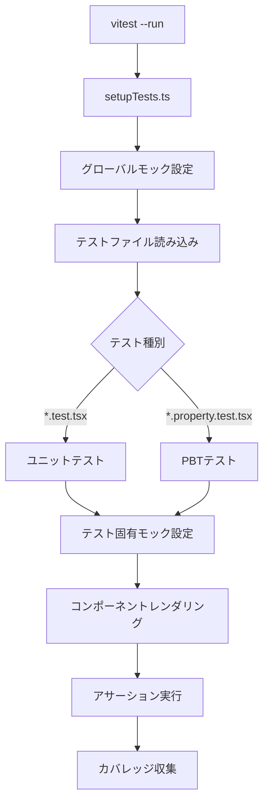

# 技術設計書: コンポーネントユニットテスト

## 概要

本設計書は `@naru/untitled-ui-library` の全UIコンポーネント（23フォルダ、40+コンポーネント）に対するユニットテストの技術設計を定義する。既存のテスト設計書（`test/test-design.md`）の方針・規約に準拠し、vitest + @testing-library/react + @testing-library/user-event + fast-check を使用してテストを実装する。

### 設計方針

- テスト設計書（`test/test-design.md`）で定義済みの規約・パターンを厳守する
- コンポーネントの内部実装ではなく、ユーザーから見える振る舞いを検証する（Testing Library の哲学）
- モック戦略により外部依存（useOptionalSekai, usePortalContainer, SVG）を分離し、テストの安定性を確保する
- PBT（プロパティベーステスト）により、ランダム入力に対する不変量を検証する

## アーキテクチャ

### テスト実行フロー



### コンポーネントカテゴリ分類

テスト対象コンポーネントを依存パターンに基づき4カテゴリに分類する：

| カテゴリ | 特徴 | モック要件 | 対象フォルダ |
|---------|------|----------|------------|
| A: 基本コンポーネント | useOptionalSekai のみ依存 | useOptionalSekai モック | button/(Basic,Strong,Stylish,Hamburger), text/, divider/, breadcrumb/, loading/, link/, select/, card/(Card), list/(List,ListItemText) |
| B: Portal コンポーネント | usePortalContainer + createPortal 使用 | useOptionalSekai + usePortalContainer モック | backdrop/, dialog/, drawer/, toast/, sidemenu/, viewer/, button/(ScrollTop), effect/(IntoTheSekai,SekaiBackground) |
| C: インタラクティブコンポーネント | 複雑な状態管理・ユーザー操作 | useOptionalSekai + 状態検証 | accordion/, dropdown/, pagination/, textfield/, card/(MusicBanner), list/(ListItemButton), tooltip/, effect/(DoReMeet) |
| D: プロバイダーコンポーネント | Context API 提供 | 統合テスト的アプローチ | provider/ |

## コンポーネントとインターフェース

### テストファイル配置マップ

```
test/components/
├── accordion/
│   └── Accordion.test.tsx
├── backdrop/
│   └── Backdrop.test.tsx
├── breadcrumb/
│   └── Breadcrumb.test.tsx
├── button/
│   ├── BasicButton.test.tsx
│   ├── HamburgerButton.test.tsx
│   ├── ScrollTopButton.test.tsx
│   ├── StrongButton.test.tsx
│   └── StylishButton.test.tsx
├── card/
│   ├── Card.test.tsx
│   ├── MusicBannerCard.test.tsx
│   └── PrskLinkCard.test.tsx
├── carousel/
│   └── Carousel.test.tsx
├── dialog/
│   ├── Dialog.test.tsx
│   ├── WindowDialog.test.tsx
│   ├── XoMikuDialog.test.tsx
│   └── XxMikuDialog.test.tsx
├── divider/
│   └── Divider.test.tsx
├── drawer/
│   └── Drawer.test.tsx
├── dropdown/
│   └── Dropdown.test.tsx
├── effect/
│   ├── DoReMeetEffect.test.tsx
│   ├── IntoTheSekai.test.tsx
│   └── SekaiBackground.test.tsx
├── link/
│   └── TextLink.test.tsx
├── list/
│   ├── List.test.tsx
│   ├── ListItemButton.test.tsx
│   ├── ListItemText.test.tsx
│   └── StickyNote.test.tsx
├── loading/
│   └── Loading.test.tsx
├── pagination/
│   └── Pagination.test.tsx
├── provider/
│   ├── YourSekaiProvider.test.tsx
│   └── SharedValueProvider.test.tsx
├── select/
│   ├── Checkbox.test.tsx
│   └── Chip.test.tsx
├── sidemenu/
│   └── SideMenu.test.tsx
├── text/
│   ├── UtilText.test.tsx
│   ├── OutlineText.test.tsx
│   ├── NamePlate.test.tsx
│   ├── TypewriterText.test.tsx
│   └── MarqueeText.test.tsx
├── textfield/
│   ├── TextField.test.tsx
│   └── TextArea.test.tsx
├── toast/
│   └── Toast.test.tsx
├── tooltip/
│   └── Tooltip.test.tsx
└── viewer/
    └── PictureViewer.test.tsx
```

### モック戦略の詳細設計

#### 共通モックモジュール

全コンポーネントテストで使用する標準モックパターン：

```typescript
// useOptionalSekai モック（カテゴリA, B, C共通）
vi.mock('@/internal/useOptionalSekai', () => ({
  useOptionalSekai: () => ({
    sekaiColor: '#00CCBB',
    modeTheme: 'light',
    isLight: true,
  }),
}))

// usePortalContainer モック（カテゴリB専用）
vi.mock('@/internal/usePortalContainer', () => ({
  usePortalContainer: () => document.body,
}))
```

#### SVG モック

`vitest.config.ts` の alias 設定により、全 `.svg` インポートが `test/__mocks__/svgMock.tsx` に解決される。テスト内での追加設定は不要。

SVGコンポーネント（ArrowSvg, ChevronSvg, ClearSvg, XoMikuSvg, XxMikuSvg 等）は内部で SVG ファイルをインポートするため、このモックにより React コンポーネントとしてレンダリングされる。

#### カテゴリ別モック設定

| カテゴリ | useOptionalSekai | usePortalContainer | 追加モック |
|---------|-----------------|-------------------|----------|
| A: 基本 | ✅ | - | - |
| B: Portal | ✅ | ✅ | - |
| C: インタラクティブ | ✅ | 一部 | タイマー（vi.useFakeTimers）、ResizeObserver |
| D: プロバイダー | モックしない | - | useLocalStorage, useSessionStorage |

#### 特殊モックパターン

```typescript
// ResizeObserver モック（MarqueeText, Dropdown で必要）
global.ResizeObserver = vi.fn().mockImplementation(() => ({
  observe: vi.fn(),
  unobserve: vi.fn(),
  disconnect: vi.fn(),
}))

// Swiper モック（Carousel で必要）
vi.mock('swiper/react', () => ({
  Swiper: ({ children, ...props }: any) => <div data-testid="swiper" {...props}>{children}</div>,
  SwiperSlide: ({ children }: any) => <div data-testid="swiper-slide">{children}</div>,
}))
vi.mock('swiper/modules', () => ({
  Autoplay: {},
  Pagination: {},
}))
vi.mock('swiper/css', () => ({}))
vi.mock('swiper/css/pagination', () => ({}))
vi.mock('swiper/css/navigation', () => ({}))

// framer-motion モック（PictureViewer で必要）
vi.mock('framer-motion', () => ({
  motion: {
    div: ({ children, ...props }: any) => <div {...props}>{children}</div>,
    button: ({ children, ...props }: any) => <button {...props}>{children}</button>,
  },
  AnimatePresence: ({ children }: any) => <>{children}</>,
}))
```

### カテゴリ別テスト実装方針

#### カテゴリA: 基本コンポーネント

最もシンプルなテストパターン。`render` + `screen` で直接レンダリングし、DOM要素を検証する。

```typescript
// 標準テンプレート
describe('ComponentName', () => {
  describe('正常系', () => {
    it('デフォルトプロパティでレンダリングされる', () => {
      render(<Component>テスト</Component>)
      expect(screen.getByText('テスト')).toBeInTheDocument()
    })
    it('className が適用される', () => { /* ... */ })
    it('rest プロパティが転送される', () => { /* ... */ })
    it('sekai プロパティで CSS 変数が設定される', () => { /* ... */ })
  })
})
```

#### カテゴリB: Portal コンポーネント

`usePortalContainer` モックにより `document.body` にレンダリングされる。`open` プロパティによる表示/非表示の切り替えを検証する。

```typescript
// Portal テンプレート
vi.mock('@/internal/usePortalContainer', () => ({
  usePortalContainer: () => document.body,
}))

describe('PortalComponent', () => {
  it('open=true で Portal 経由でレンダリングされる', () => {
    render(<Component open={true} onClose={vi.fn()}>コンテンツ</Component>)
    expect(screen.getByRole('dialog')).toBeInTheDocument()
  })
  it('open=false で DOM に存在しない', () => {
    render(<Component open={false} onClose={vi.fn()}>コンテンツ</Component>)
    expect(screen.queryByRole('dialog')).not.toBeInTheDocument()
  })
})
```

#### カテゴリC: インタラクティブコンポーネント

`userEvent` を使用してユーザー操作をシミュレートし、状態変化を検証する。

```typescript
// インタラクティブテンプレート
describe('InteractiveComponent', () => {
  it('クリックで状態が切り替わる', async () => {
    const user = userEvent.setup()
    render(<Component />)
    await user.click(screen.getByRole('button'))
    expect(screen.getByRole('button')).toHaveAttribute('aria-expanded', 'true')
  })
})
```

#### カテゴリD: プロバイダーコンポーネント

テスト用の子コンポーネントを作成し、Context 値を検証する。

```typescript
// プロバイダーテンプレート
const TestConsumer = () => {
  const context = useContext(YourSekaiContext)
  return <div data-testid="sekai">{context?.sekaiTheme.palette.sekai}</div>
}

describe('YourSekaiProvider', () => {
  it('コンテキスト値を子コンポーネントに提供する', () => {
    render(
      <YourSekaiProvider sekaiTheme={testTheme}>
        <TestConsumer />
      </YourSekaiProvider>
    )
    expect(screen.getByTestId('sekai')).toHaveTextContent('Miku')
  })
})
```

## データモデル

### テスト対象コンポーネント一覧

| # | フォルダ | コンポーネント | カテゴリ | テストファイル数 |
|---|---------|-------------|---------|--------------|
| 1 | accordion/ | Accordion | C | 1 |
| 2 | backdrop/ | Backdrop | B | 1 |
| 3 | breadcrumb/ | Breadcrumb | A | 1 |
| 4 | button/ | BasicButton, HamburgerButton, ScrollTopButton, StrongButton, StylishButton | A/B | 5 |
| 5 | card/ | Card, CardContent, CardTitle, MusicBannerCard, PrskLinkCard | A/C | 3 |
| 6 | carousel/ | Carousel | A | 1 |
| 7 | dialog/ | Dialog, WindowDialog, XoMikuDialog, XxMikuDialog | B | 4 |
| 8 | divider/ | Divider | A | 1 |
| 9 | drawer/ | Drawer | B | 1 |
| 10 | dropdown/ | Dropdown | C | 1 |
| 11 | effect/ | DoReMeetEffect, IntoTheSekai, SekaiBackground | B/C | 3 |
| 12 | link/ | TextLink | A | 1 |
| 13 | list/ | List, ListItemButton, ListItemText, StickyNote | A/C | 4 |
| 14 | loading/ | Loading | A | 1 |
| 15 | pagination/ | Pagination | C | 1 |
| 16 | provider/ | YourSekaiProvider, SharedValueProvider | D | 2 |
| 17 | select/ | Checkbox, Chip | A/C | 2 |
| 18 | sidemenu/ | SideMenu | B | 1 |
| 19 | text/ | BodyText, SekaiBodyText, DetailText, AnnotationText, SekaiAnnotationText, OutlineText, NamePlate, TypewriterText, MarqueeText | A | 5 |
| 20 | textfield/ | TextField, TextArea | C | 2 |
| 21 | toast/ | Toast | B | 1 |
| 22 | tooltip/ | Tooltip | C | 1 |
| 23 | viewer/ | PictureViewer | B | 1 |

合計テストファイル数: 約44ファイル

### 共通テストデータ

```typescript
// テスト用 sekai カラーキー
const TEST_SEKAI_COLOR = '#00CCBB'  // Miku カラー
const TEST_MODE_THEME = 'light'

// useOptionalSekai モックの戻り値
const mockSekaiReturn = {
  sekaiColor: TEST_SEKAI_COLOR,
  modeTheme: TEST_MODE_THEME,
  isLight: true,
}

// Dialog 系テスト用共通 props
const dialogDefaultProps = {
  open: true,
  onClose: vi.fn(),
  title: 'テストダイアログ',
}
```


## 正当性プロパティ（Correctness Properties）

*プロパティとは、システムの全ての有効な実行において成り立つべき特性や振る舞いのことである。人間が読める仕様と機械的に検証可能な正当性保証の橋渡しとなる形式的な記述である。*

本プロジェクトのコンポーネントテストにおいて、以下の正当性プロパティを定義する。これらは fast-check を使用したプロパティベーステストとして実装される。

### Property 1: プロパティ転送の不変量

*任意の* CSS クラス名文字列に対して、コンポーネントに `className` として渡した場合、レンダリングされたルート要素のクラスリストにその文字列が含まれること。また、*任意の* `data-*` 属性に対して、コンポーネントに渡した場合、レンダリングされたDOM要素にその属性が転送されること。

**Validates: Requirements 2.2, 2.3, 17.1**

### Property 2: sekai CSS 変数設定の不変量

*任意の* 有効な sekai カラーキー（ColorsSekaiKey の全バリアント）に対して、コンポーネントに `sekai` プロパティとして渡した場合、レンダリングされた要素の `style` 属性に `--sekai-color` CSS 変数が設定されること。

**Validates: Requirements 2.5, 17.2**

### Property 3: NamePlate テキスト分割の正当性

*任意の* 非空文字列 `text` と *任意の* 正整数 `colorLength`（1 ≤ colorLength ≤ text.length）に対して、NamePlate コンポーネントは先頭 `colorLength` 文字を色付き `span` 要素に、残りの文字を通常の `span` 要素に分割して表示すること。両方の `span` のテキストを結合すると元の `text` と一致すること。

**Validates: Requirements 8.6**

## エラーハンドリング

### コンポーネントレベルのエラーハンドリング

| エラーケース | 対象コンポーネント | 期待動作 | テスト方法 |
|------------|-----------------|---------|----------|
| Portal コンテナが null | Backdrop, Dialog, Drawer, Toast, SideMenu 等 | `null` を返す（何もレンダリングしない） | `usePortalContainer` が `null` を返すモックでテスト |
| useSharedValueContext が Provider 外で使用 | SharedValueProvider | `Error` をスロー | `expect(() => ...).toThrow()` |
| ListItemText/ListItemButton が List 外で使用 | ListItemText, ListItemButton, StickyNote | コンソール警告を出力（レンダリングは継続） | `vi.spyOn(console, 'warn')` |
| Dialog の title が未指定 | Dialog, XoMikuDialog, XxMikuDialog | `aria-label="Dialog"` がフォールバック値として設定 | `aria-label` 属性の検証 |

### テストにおけるエラーハンドリング検証パターン

```typescript
// Provider 外でのコンテキスト使用エラー
it('SharedValueProvider の外で useSharedValueContext を使用するとエラーがスローされる', () => {
  const { useSharedValueContext } = createSharedValueProvider<string>()
  const TestComponent = () => {
    useSharedValueContext()
    return null
  }
  expect(() => render(<TestComponent />)).toThrow(
    'useSharedValueContext must be used within a SharedValueProvider.'
  )
})

// List 外での使用警告
it('List 外で ListItemText を使用すると警告が出力される', () => {
  const warnSpy = vi.spyOn(console, 'warn').mockImplementation(() => {})
  render(<ListItemText>テスト</ListItemText>)
  expect(warnSpy).toHaveBeenCalled()
  warnSpy.mockRestore()
})
```

## テスト戦略

### デュアルテストアプローチ

本プロジェクトでは、ユニットテストとプロパティベーステストの2つのアプローチを併用する：

| アプローチ | 目的 | ツール | ファイル拡張子 |
|-----------|------|-------|-------------|
| ユニットテスト | 具体的な例、エッジケース、エラー条件の検証 | vitest + @testing-library/react + user-event | `*.test.tsx` |
| プロパティベーステスト（PBT） | ランダム入力に対する普遍的プロパティの検証 | vitest + fast-check + @testing-library/react | `*.property.test.tsx` |

### ユニットテスト戦略

各コンポーネントに対して、テスト設計書セクション4.3の共通チェックリストに基づくテストケースを実装する：

1. デフォルトプロパティでのレンダリング検証
2. `className` の適用検証
3. `...rest` プロパティの転送検証
4. `children` の表示検証（該当する場合）
5. `sekai` プロパティによる CSS 変数設定の検証
6. `disabled` 状態の検証（該当する場合）
7. アクセシビリティ属性の検証（`role`, `aria-*`）
8. キーボード/マウスインタラクションの検証（該当する場合）

### プロパティベーステスト（PBT）戦略

#### PBT ライブラリ

- **fast-check** v3.23.2（プロジェクトに導入済み）

#### PBT 設定

- 各プロパティテストは最低 **100回** 実行する（`{ numRuns: 100 }`）
- 各テストケースに設計書プロパティへの参照コメントを付与する
- タグ形式: `// Feature: component-unit-tests, Property {N}: {プロパティテキスト}`

#### PBT 実装対象

| Property # | プロパティ名 | 対象コンポーネント | Arbitrary |
|-----------|------------|-----------------|-----------|
| 1 | プロパティ転送の不変量 | 代表コンポーネント（BasicButton, Divider, Loading 等） | `fc.string()` for className, `fc.string({ minLength: 1 })` for data-* values |
| 2 | sekai CSS 変数設定の不変量 | 代表コンポーネント（BasicButton, Card, Loading 等） | `fc.constantFrom(...colorSekaiKeyList)` |
| 3 | NamePlate テキスト分割の正当性 | NamePlate | `fc.string({ minLength: 1 })` for text, `fc.integer({ min: 1 })` for colorLength |

#### PBT テストテンプレート

```typescript
// test/components/button/BasicButton.property.test.tsx
import { describe, it, expect } from 'vitest'
import fc from 'fast-check'
import { render, screen } from '@testing-library/react'
import { BasicButton } from '@/components/button/BasicButton'

vi.mock('@/internal/useOptionalSekai', () => ({
  useOptionalSekai: () => ({
    sekaiColor: '#00CCBB',
    modeTheme: 'light',
    isLight: true,
  }),
}))

describe('BasicButton - プロパティベーステスト', () => {
  // Feature: component-unit-tests, Property 1: プロパティ転送の不変量
  it('任意の className がルート要素に適用される', () => {
    fc.assert(
      fc.property(
        fc.string({ minLength: 1 }).filter(s => /^[a-zA-Z_]/.test(s)),
        (className) => {
          const { unmount } = render(
            <BasicButton className={className}>テスト</BasicButton>
          )
          expect(screen.getByRole('button')).toHaveClass(className)
          unmount()
        }
      ),
      { numRuns: 100 }
    )
  })
})
```

### カバレッジ戦略

| 対象ディレクトリ | ステートメント目標 | 備考 |
|-----------------|-----------------|------|
| `src/components/` | 60% 以上 | テスト設計書で定義済みの基準 |

#### 除外対象

- `src/**/*.d.ts` — 型定義ファイル
- `src/**/index.ts` — 自動生成バレルファイル

#### カバレッジ実行コマンド

```bash
npx vitest --run --coverage
```

### テスト実行コマンド

```bash
# 全ユニットテスト実行
npm run test:unit

# コンポーネントテストのみ実行
npx vitest --run test/components/

# 特定コンポーネントのテスト実行
npx vitest --run test/components/button/BasicButton.test.tsx

# PBT のみ実行
npx vitest --run test/components/ -t "プロパティベーステスト"

# カバレッジ付き実行
npx vitest --run --coverage
```

### 実装優先順位

テスト実装は以下の優先順位で進める：

1. **カテゴリA（基本コンポーネント）**: モック要件が最小で、テンプレート化しやすい
2. **カテゴリC（インタラクティブ）**: ユーザー操作の検証が重要
3. **カテゴリB（Portal）**: Portal モックの追加が必要だが、パターンは統一的
4. **カテゴリD（プロバイダー）**: Context API の統合テスト的アプローチが必要
5. **PBT**: ユニットテスト完了後に追加
