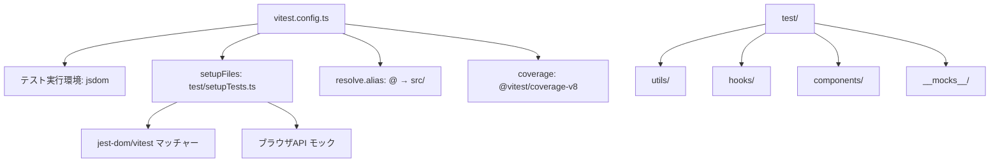
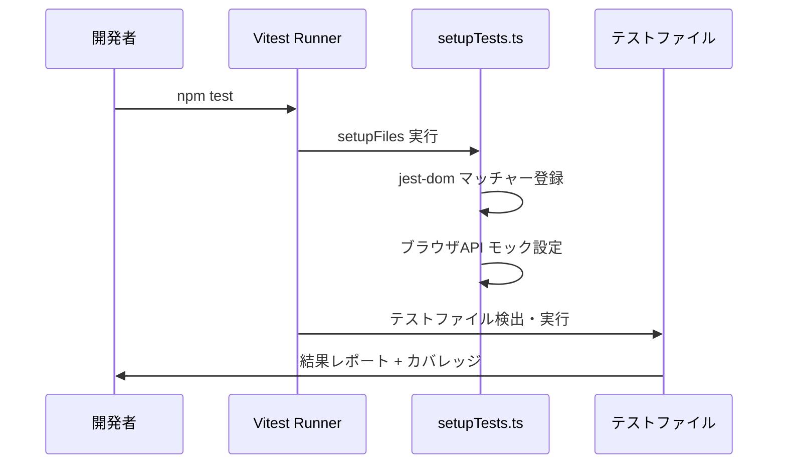

# 設計ドキュメント: UIライブラリ単体テスト戦略

## 概要

本設計は `@naru/untitled-ui-library` に対する Vitest ベースの単体テスト環境を構築し、ユーティリティ関数・カスタムフック・UIコンポーネントの品質を保証するテスト戦略を定義する。

現状の Jest 環境（`jest.config.js` + `ts-jest`）から Vitest へ移行し、Vite のネイティブ ESM サポートと高速な HMR を活用する。テスト対象は以下の3層に分類される：

1. **ユーティリティ関数**（`src/utils/`）: `converter.ts`、`serialization.ts`、`timer.ts`、`operation.ts` の純粋関数群
2. **カスタムフック**（`src/hooks/`）: `useLocalStorage`、`useThemeMode`、`useWindowSize` 系フック群
3. **UIコンポーネント**（`src/components/`）: 23カテゴリのテーマ対応コンポーネント群

テストは `test/` ディレクトリに配置し、ソースコードのディレクトリ構造をミラーリングする。

## アーキテクチャ

### テスト環境構成



### テスト実行フロー



### 設計判断

- **Vitest 採用理由**: プロジェクトが既に Vite を devDependency に持ち（Storybook 経由）、ESM ネイティブサポートにより `ts-jest` のトランスパイルが不要になる。Jest API との互換性が高く、移行コストが低い。
- **jsdom 環境**: React コンポーネントのレンダリングとDOM操作テストに必要。`happy-dom` より `jsdom` を選択したのは、`@testing-library/jest-dom` との互換性が確立されているため。
- **CSS Modules 処理**: Vitest の `css.modules.classNameStrategy: 'non'` ではなく、identity-obj-proxy 相当の動作を `vi.mock` で実現し、クラス名ベースのアサーションを可能にする。

## コンポーネントとインターフェース

### 1. vitest.config.ts

テスト環境の中核設定ファイル。

```typescript
import { defineConfig } from 'vitest/config'
import path from 'path'

export default defineConfig({
  resolve: {
    alias: {
      '@': path.resolve(__dirname, 'src'),
    },
  },
  test: {
    environment: 'jsdom',
    globals: true,
    setupFiles: ['./test/setupTests.ts'],
    include: ['test/**/*.test.{ts,tsx}'],
    exclude: ['node_modules', 'dist', 'test/templates'],
    coverage: {
      provider: 'v8',
      include: ['src/**/*.{ts,tsx}'],
      exclude: ['src/**/*.d.ts', 'src/**/index.ts'],
      reporter: ['html', 'lcov', 'text'],
      reportsDirectory: 'coverage',
    },
    css: {
      modules: {
        classNameStrategy: 'non',
      },
    },
  },
})
```

### 2. test/setupTests.ts

テスト環境の初期化ファイル。

```typescript
import '@testing-library/jest-dom/vitest'

// requestAnimationFrame モック
global.requestAnimationFrame = (cb: FrameRequestCallback) => {
  return setTimeout(cb, 0) as unknown as number
}
global.cancelAnimationFrame = (id: number) => clearTimeout(id)

// matchMedia モック
Object.defineProperty(window, 'matchMedia', {
  writable: true,
  value: vi.fn().mockImplementation((query: string) => ({
    matches: false,
    media: query,
    onchange: null,
    addListener: vi.fn(),
    removeListener: vi.fn(),
    addEventListener: vi.fn(),
    removeEventListener: vi.fn(),
    dispatchEvent: vi.fn(),
  })),
})

// scrollTo モック
window.scrollTo = vi.fn() as unknown as typeof window.scrollTo
```

### 3. test/__mocks__/svgMock.tsx

SVG インポートのモック。

```typescript
const SvgMock = (props: Record<string, unknown>) => <svg {...props} />
export default SvgMock
export { SvgMock }
```

### 4. テストファイル構成

```
test/
├── setupTests.ts
├── __mocks__/
│   └── svgMock.tsx
├── utils/
│   ├── converter.test.ts
│   ├── serialization.test.ts
│   ├── timer.test.ts
│   └── operation.test.ts
├── hooks/
│   ├── useLocalStorage.test.ts
│   ├── useThemeMode.test.ts
│   └── useWindowSize.test.ts
└── components/
    ├── button/
    │   └── BasicButton.test.tsx
    ├── dialog/
    │   └── Dialog.test.tsx
    └── ...（各コンポーネントフォルダ）
```


### 5. テストパターン

#### ユーティリティ関数テスト

純粋関数のため、入力と出力の検証に集中する。

```typescript
// test/utils/converter.test.ts
import { describe, it, expect } from 'vitest'
import { convertHexToRgb } from '@/utils/converter'

describe('convertHexToRgb', () => {
  it('有効なHEXカラーをRGBに変換する', () => {
    expect(convertHexToRgb('#FF0000')).toBe('rgb(255, 0, 0)')
  })

  it('無効なHEXカラーでエラーをスローする', () => {
    expect(() => convertHexToRgb('invalid')).toThrow()
  })
})
```

#### カスタムフックテスト

`renderHook` を使用してフックの状態変化を検証する。

```typescript
// test/hooks/useLocalStorage.test.ts
import { renderHook, act } from '@testing-library/react'
import { useLocalStorage } from '@/hooks/useLocalStorage'

describe('useLocalStorage', () => {
  it('初期値が正しく設定される', () => {
    const { result } = renderHook(() => useLocalStorage('key', 'default'))
    expect(result.current.storedValue).toBe('default')
  })
})
```

#### UIコンポーネントテスト

`render` + `screen` でレンダリングとインタラクションを検証する。コンポーネントが `useOptionalSekai` に依存するため、`YourSekaiProvider` でラップするか、内部コンテキストをモックする。

```typescript
// test/components/button/BasicButton.test.tsx
import { render, screen } from '@testing-library/react'
import { BasicButton } from '@/components/button/BasicButton'

describe('BasicButton', () => {
  it('デフォルトプロパティでレンダリングされる', () => {
    render(<BasicButton>テスト</BasicButton>)
    expect(screen.getByRole('button')).toBeInTheDocument()
  })
})
```

## データモデル

### テスト対象のデータ構造

#### ユーティリティ関数の入出力

| 関数 | 入力型 | 出力型 | 備考 |
|------|--------|--------|------|
| `convertHexToRgb` | `string` (#RRGGBB) | `string` (rgb(...)) | 正規表現バリデーション |
| `convertHexToRgba` | `string`, `number` | `string` (rgba(...)) | alpha: 0-1 |
| `convertHexToRgbaMixWithBlackOrWhite` | `string`, `number`, `boolean`, `number` | `string` (rgba(...)) | mixRatio: 0-1 |
| `serializeData` | `T` | `unknown` | Date → ISO文字列、循環参照検出 |
| `deserializeData` | `unknown` | `unknown` | ISO文字列 → Date |
| `getFormattedTime` | `Date`, `string`, `string` | `string` | 5種のフォーマット |
| `getCustomCurrentTime` | `Date`, `string` | `string` | パターン置換 |
| `fireOnEnterKey` | `handler` | `handler` | Enter キーのみ発火 |
| `fireOnEscapeKey` | `handler` | `handler` | Escape キーのみ発火 |
| `shuffleArray` | `T[]` | `T[]` | Fisher-Yates、要素保存 |

#### カスタムフックの状態

| フック | 状態 | 副作用 |
|--------|------|--------|
| `useLocalStorage<T>` | `storedValue: T` | `localStorage` 読み書き、`storage` イベント監視 |
| `useThemeMode` | `PaletteMode` | `matchMedia` 監視 |
| `useInnerSize` | `number` | `resize` イベント監視 |
| `useOrientation` | `Orientation` | `useInnerSize` 依存 |
| `createSekai` | `SekaiTheme` | なし（純粋関数） |

#### コンポーネント共通プロパティ

```typescript
interface CommonTestableProps {
  sekai?: ColorsSekaiKey      // テーマカラー → CSS変数 --sekai-color
  themeMode?: PaletteMode     // light | dark → クラス名切替
  className?: string          // 追加クラス名
  children?: React.ReactNode  // 子要素
  // ...rest → 基礎HTML要素に転送
}
```


## 正当性プロパティ（Correctness Properties）

*プロパティとは、システムのすべての有効な実行において真であるべき特性や振る舞いのことである。プロパティは、人間が読める仕様と機械が検証可能な正当性保証の橋渡しとなる。*

### Property 1: HEX→RGB 変換の正当性

*For any* 有効な6桁HEXカラー文字列（#RRGGBB形式）に対して、`convertHexToRgb` の出力は `rgb(R, G, B)` 形式の文字列であり、各成分値は元のHEX値を10進数に変換した値と一致すること。

**Validates: Requirements 2.1**

### Property 2: HEX→RGBA 変換と混合色計算の正当性

*For any* 有効な6桁HEXカラー文字列、[0,1] 範囲のアルファ値、[0,1] 範囲の混合比率、および白/黒の混合フラグに対して、`convertHexToRgba` と `convertHexToRgbaMixWithBlackOrWhite` の出力は `rgba(R, G, B, A)` 形式の文字列であり、各成分値は数学的に正しい変換・混合結果と一致すること。

**Validates: Requirements 2.2, 2.3**

### Property 3: 無効入力に対するエラー発生

*For any* #RRGGBB パターンに一致しない文字列を `convertHexToRgb` / `convertHexToRgba` に渡した場合、および [0,1] 範囲外の数値をアルファ値や混合比率として渡した場合、関数はエラーをスローすること。

**Validates: Requirements 2.4, 2.5**

### Property 4: シリアライゼーション ラウンドトリップ

*For any* プリミティブ値、Date オブジェクト、配列、ネストされたオブジェクトを含む有効なデータ構造に対して、`deserializeData(JSON.parse(JSON.stringify(serializeData(data))))` は元のデータと等価なオブジェクトを生成すること。

**Validates: Requirements 2.6, 2.7, 2.8**

### Property 5: 時刻フォーマットの正当性

*For any* 有効な Date オブジェクトに対して、`getFormattedTime` は指定されたフォーマットタイプ（datetime, date, time, timestamp, iso）に応じた正しい文字列を返し、`getCustomCurrentTime` はパターン内の YYYY, MM, DD, HH, mm, ss プレースホルダーを Date の対応する値で正しく置換すること。

**Validates: Requirements 2.10, 2.11**

### Property 6: キーボードイベントハンドラーの選択性

*For any* キーボードイベントに対して、`fireOnEnterKey` で生成されたハンドラーは `key === 'Enter'` の場合のみコールバックを呼び出し、`fireOnEscapeKey` で生成されたハンドラーは `key === 'Escape'` の場合のみコールバックを呼び出すこと。それ以外のキーではコールバックは呼び出されないこと。

**Validates: Requirements 2.12, 2.13**

### Property 7: shuffleArray の不変量

*For any* 配列に対して、`shuffleArray` の出力は入力と同じ長さであり、同じ要素を（マルチセットとして）含むこと。

**Validates: Requirements 2.14**

### Property 8: useLocalStorage の値保存ラウンドトリップ

*For any* キー文字列と初期値に対して、`useLocalStorage` で値を `setStoredValue` で設定した後、`localStorage.getItem` で取得しデシリアライズした結果は設定した値と等価であること。また、localStorage が空の場合は初期値が返されること。

**Validates: Requirements 3.1, 3.2**

### Property 9: useLocalStorage の削除によるリセット

*For any* 保存済みの値に対して、`deleteLocalStorage` を呼び出した後、`storedValue` は初期値にリセットされ、`localStorage` から該当キーが削除されること。

**Validates: Requirements 3.3**

### Property 10: useLocalStorage のクロスタブ同期

*For any* storage イベント（同一キー）に対して、`useLocalStorage` は `newValue` をデシリアライズして `storedValue` を更新し、`newValue` が null の場合は初期値にリセットすること。

**Validates: Requirements 3.4**

### Property 11: useInnerSize のウィンドウ幅追従

*For any* ウィンドウ幅の変更に対して、`useInnerSize` は `resize` イベント後に `Math.min(document.documentElement.clientWidth, window.innerWidth)` と等しい値を返すこと。

**Validates: Requirements 3.6**

### Property 12: useOrientation のブレークポイント判定

*For any* 正の整数のウィンドウ幅に対して、`useOrientation` は幅が 768 以下の場合 `'PORTRAIT'` を、それ以外の場合 `'LANDSCAPE'` を返すこと。

**Validates: Requirements 3.7**

### Property 13: createSekai のデフォルト値フォールバック

*For any* `SekaiThemeProps` の部分的な入力に対して、`createSekai` は省略されたフィールドにデフォルト値（mode: 'light', fontFamily: 'Montserrat, sans-serif'）を適用した完全な `SekaiTheme` オブジェクトを返すこと。

**Validates: Requirements 3.8**

### Property 14: コンポーネントのプロパティ転送

*For any* コンポーネントと任意の `className` 文字列、`data-*` 属性、および `children` コンテンツに対して、レンダリング結果の基礎要素には `className` が含まれ、`data-*` 属性が転送され、`children` の内容が表示されること。

**Validates: Requirements 4.2, 4.3, 4.10**

### Property 15: sekai プロパティによる CSS 変数設定

*For any* コンポーネントと有効な `ColorsSekaiKey` に対して、`sekai` プロパティを指定した場合、レンダリング結果の要素に `--sekai-color` CSS 変数が対応するカラーコードで設定されること。

**Validates: Requirements 4.4**


## エラーハンドリング

### ユーティリティ関数のエラー

| 関数 | エラー条件 | 期待される動作 |
|------|-----------|---------------|
| `convertHexToRgb` | `#RRGGBB` パターン不一致 | `Error('Invalid hex color format. Use #RRGGBB')` をスロー |
| `convertHexToRgba` | HEX不正 or alpha ∉ [0,1] | 対応するエラーメッセージでスロー |
| `convertHexToRgbaMixWithBlackOrWhite` | HEX不正 or mixRatio ∉ [0,1] or alpha ∉ [0,1] | 対応するエラーメッセージでスロー |
| `serializeData` | 循環参照オブジェクト | `Error('Circular reference detected during serializeData')` をスロー |
| `deserializeData` | 循環参照オブジェクト | `Error('Circular reference detected during deserialization')` をスロー |

### フックのエラー

| フック | エラー条件 | 期待される動作 |
|--------|-----------|---------------|
| `useLocalStorage` | localStorage アクセス失敗 | `ConsoleError` でログ出力、初期値を維持 |
| `useCreateSekai` | Provider 外での使用 | `Error('useCreateSekai must be used within a YourSekaiProvider')` をスロー |

### テスト環境のエラー対策

- **SVG インポートエラー**: `vi.mock` で SVG モジュールをモックし、React コンポーネントを返す
- **CSS Modules エラー**: `css.modules.classNameStrategy` 設定でクラス名を処理
- **Portal コンテナ未定義**: `usePortalContainer` が `document.body` にフォールバック。テストでは jsdom が `document.body` を提供

## テスト戦略

### テストフレームワーク構成

| ツール | 用途 |
|--------|------|
| `vitest` | テストランナー・アサーション |
| `@testing-library/react` | コンポーネントレンダリング・クエリ |
| `@testing-library/user-event` | ユーザーインタラクションシミュレーション |
| `@testing-library/jest-dom/vitest` | DOM マッチャー拡張 |
| `@vitest/coverage-v8` | カバレッジ収集 |
| `fast-check` | プロパティベーステスト |

### デュアルテストアプローチ

本プロジェクトでは、ユニットテストとプロパティベーステストの両方を採用する。

#### ユニットテスト

具体的な例、エッジケース、エラー条件の検証に使用する。

- Dialog の `open=true` / `open=false` の表示切替（要件 4.6, 4.7）
- Dialog の `role="dialog"` と `aria-label` の存在（要件 4.8）
- Dialog の Escape キーによる `onClose` 呼び出し（要件 4.9）
- Button の `disabled` 状態（要件 4.5）
- `useThemeMode` の light/dark 切替（要件 3.5）
- 循環参照オブジェクトの `serializeData` エラー（要件 2.9）
- カバレッジ設定の除外パターン確認（要件 5.4, 5.5）

#### プロパティベーステスト

普遍的なプロパティを多数のランダム入力で検証する。

- **ライブラリ**: `fast-check`（TypeScript ネイティブ、Vitest との統合が容易）
- **最小実行回数**: 各プロパティテストにつき 100 回以上
- **タグ形式**: `Feature: unit-test-strategy, Property {number}: {property_text}`

各正当性プロパティ（Property 1〜15）は、それぞれ1つのプロパティベーステストとして実装する。

```typescript
// 例: Property 7 - shuffleArray の不変量
import fc from 'fast-check'

describe('shuffleArray', () => {
  // Feature: unit-test-strategy, Property 7: shuffleArray の不変量
  it('任意の配列に対して、要素と長さが保存される', () => {
    fc.assert(
      fc.property(fc.array(fc.integer()), (arr) => {
        const shuffled = shuffleArray(arr)
        expect(shuffled).toHaveLength(arr.length)
        expect(shuffled.sort()).toEqual([...arr].sort())
      }),
      { numRuns: 100 }
    )
  })
})
```

### テスト優先度

| 優先度 | 対象 | 理由 |
|--------|------|------|
| 高 | ユーティリティ関数 | 純粋関数で依存が少なく、プロパティテストに最適 |
| 高 | カスタムフック | 状態管理とブラウザAPI連携の正当性が重要 |
| 中 | Dialog コンポーネント | Portal・アクセシビリティ・キーボード操作の複合テスト |
| 中 | Button コンポーネント | テーマ・disabled・イベントの基本パターン |
| 低 | その他コンポーネント | 共通パターンの検証で代表的なものをカバー |

### カバレッジ目標

| 対象 | ステートメント | ブランチ |
|------|--------------|---------|
| `src/utils/` | 80%+ | - |
| `src/hooks/` | - | 70%+ |
| `src/components/` | 60%+ | - |

カバレッジレポートは `coverage/` ディレクトリに HTML 形式と LCOV 形式で出力する。`@vitest/coverage-v8` プロバイダーを使用する。

